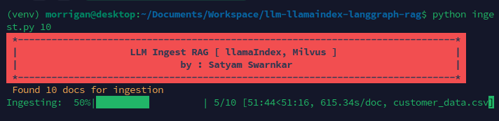

# LLM implementation with LangGraph
Local LLM implementation with llamaindex & LangGraph, RAG on Milvus , Ollama

## Purpose : 
1. Ingest document using llamaindex 
2. Generate embeddings and store in Milvus
3. Use Ollama LLM to create prompt on CLI
4. query in embeddings using llamaindex.
5. Use LLM to compose response.

## How to setup 
1. Clone the repo "git@github.com:satyamsoni/llm-llamaindex-langgraph-rag.git"
2. Run Setup file "source ./setup.sh" after giving execute permission.

## How to Try
run "python ingest.py <document_batch_size>"

